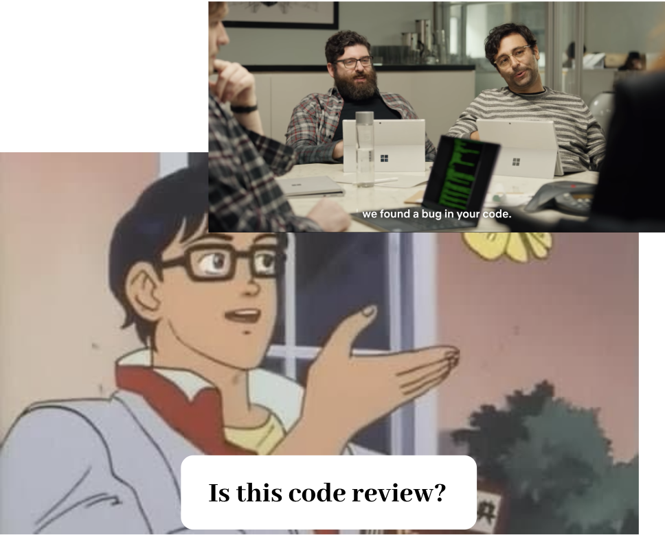

<small style="text-align: center; display: block;">A Netflix show <i>Russian Doll</i>, misrepresenting what code review is. Otherwise an excellent show.</small>

As software developers, code review is an important part of our job. Our coworkers in different functions may exchange emails, spreadsheets or invoices. Do they? Well, actually I don't really know what they do. What I do know, however, is that we write code, read code and talk about code all the time. For many of us, the exchange of code is our primary way of communication, and it is mostly done through code review.

 I always try to argue the importance of code review beyond the popular perspective of seeing it as a gatekeeping process, or when occasionally talked about in the context of knowledge sharing, as a way for more senior developers to educate their junior counterparts. These views, though valid in every way, assume that authors learn from the reviewers but not the other way around, failing to capture the collaborative and communicative nature of code reviews.

Yes, the reviewer might pick up critical mistakes that the author didn't see. Yes, authors who lack certain experience can always benefit from the eyes of the more knowledgeable.

But hey, code review is definitely a two-way street and reviewers learn a ton too! Here I present a list of some of the things we learn when review code.

### 🗒 We learn more about the codebase

In the short term, we learn about the bit of code we are reviewing. And we may be able to say, 'I can fix bugs in this part of the code next time the author is on leave'.

In the long term, we obtain broader view of the codebase. What are the prevalent patterns that are being used? What are the 3rd party libraries we are using? What are the common pain points? Where are the parts of code that can potentially be combined together? These are some of the questions that can be answered by those who often read code that they didn't write themselves.

### 👩‍💻 We learn how to code better

There are immediate wins when you go 'I didn't know you can do that! I will use it next time'. Then there are yet again broader benefits from being exposed to different approaches and having discussions about them. You can have discussions elsewhere too, but code review is a good place to start them. Review comments that lead to learning often look like this: 'XXX is used here but we can achieve the same with YYY. What do you think are the reasons why one would prefer one to another?'

### 📚 We learn how to read code better

We get better at reading code as we read more code, and everyone knows that reading code - reasoning author's intent accurately and promptly - is an important skill.

### 🤝 We learn about our colleagues

We notice their styles, strengths, weaknesses, growth and so on. People management may not be your main gig, but these are definitely nice-to-knows. You'll know who to talk to when you have certain issues, when to give kudos for great contribution, and what relevant feedbacks to give to your peers.

### 🗣 We learn how to communicate better

An amazing side effect you get from communicating your feedbacks about someone else's work all the time is that you get better and better at sharing your opinions respectfully and effectively. It takes real hard work, but, eventually, we get better at things that we put our time and effort into.
